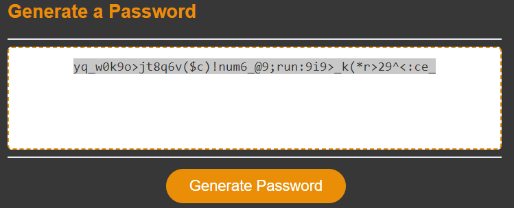

# Password Generator

## Description

This is the Password Generator app, where you can create a secure password. You can choose what type of password you need to create, from a basic password (letters) to a complex password (letters, numbers and special characters).

After choosing your options,  this application will take random values to create your password and you can see it on the main card.

## Technologies

- HTML5
- CSS3
- JavaScript

## Usage

Open deployed app at https://andedu15.github.io/passwordGenerator/

 - Click on "Generate Password" button.

 

 - Choose the LENGTH of your password.

 

 - Choose if you want LOWERCASE.

 

 - Choose if you want UPPERCASE.

 

 - Choose if you want NUMBERS.

 

 - Choose if you want SPECIAL CHARACTERS.

 

 - You will see your choices.

 

 - Password generator will create your password.

 

## Screenshot

Main card

