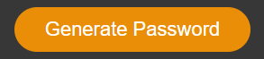

# Password Generator

## Description

This is my first portfolio where you will find a little about me, my skills and my projects.

For the creation of this web page, I applied my knowledge of html, css and a bit of bootstrap. So, used flexbox and a media query to solve the responsive layout, use some hovers to animate the links.

You will find my first project and my Coming Soon Projects that I will update. For this coming soon projects, you will see a background image with "Web under construction meanwhile".

## Technologies

- HTML5
- CSS3
- JavaScript

## Usage

Open deployed app at https://andedu15.github.io/Portfolio/

 - Click on "Generate Password" button.

 

 - Choose the LENGTH of your password.

 

 - Choose if you want LOWERCASE.

 

 - Choose if you want UPPERCASE.

 

 - Choose if you want NUMBERS.

 

 - Choose if you want SPECIAL CHARACTERS.

 

 - You will see your choices.

 

## Screenshot

Main card

